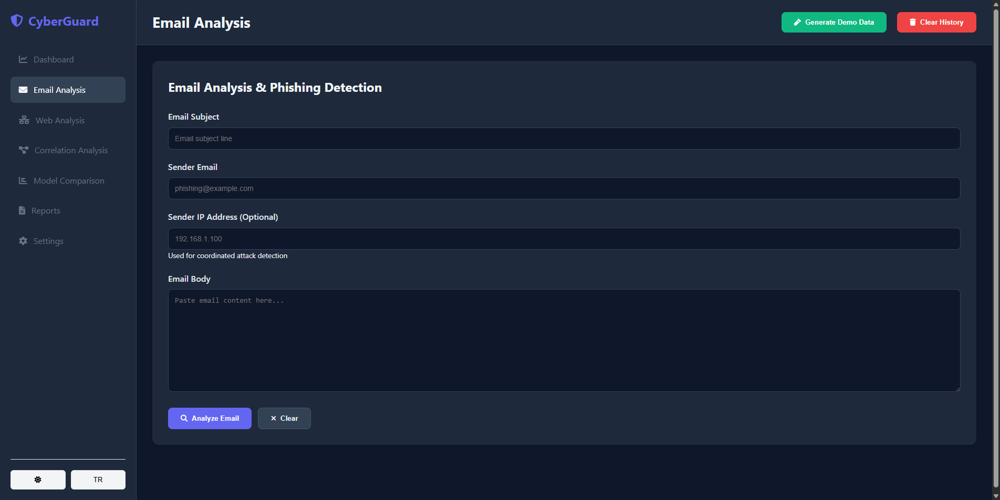
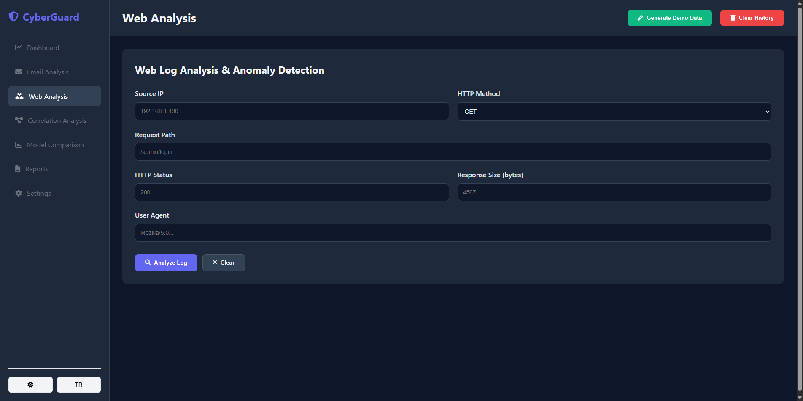
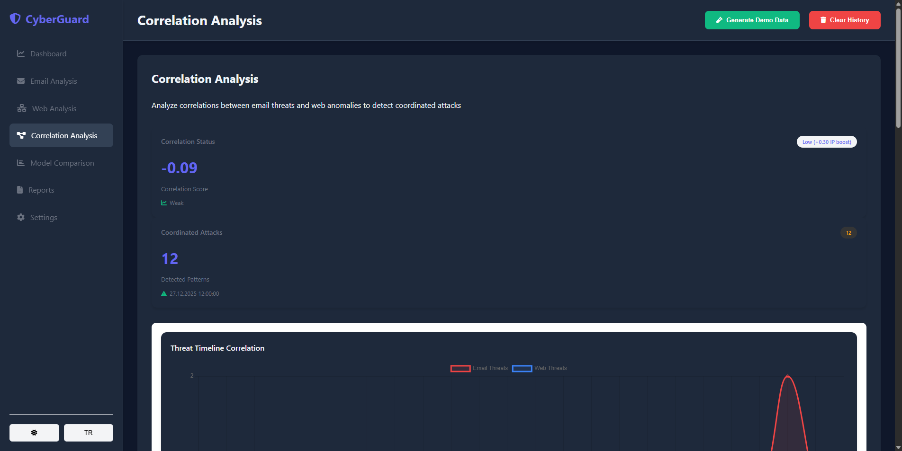
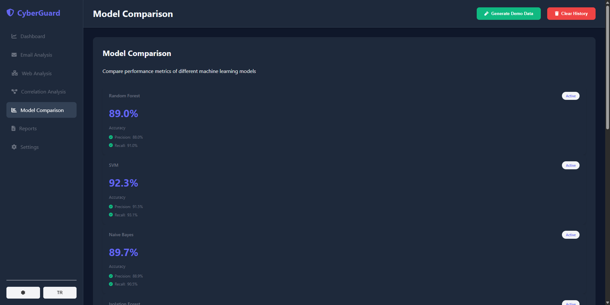
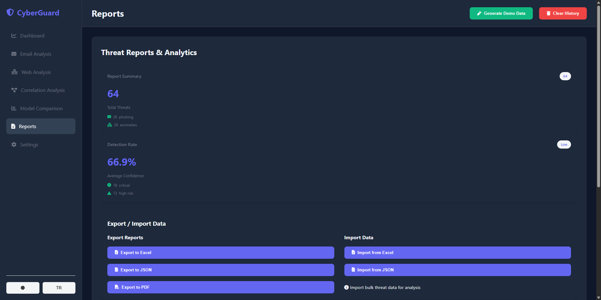
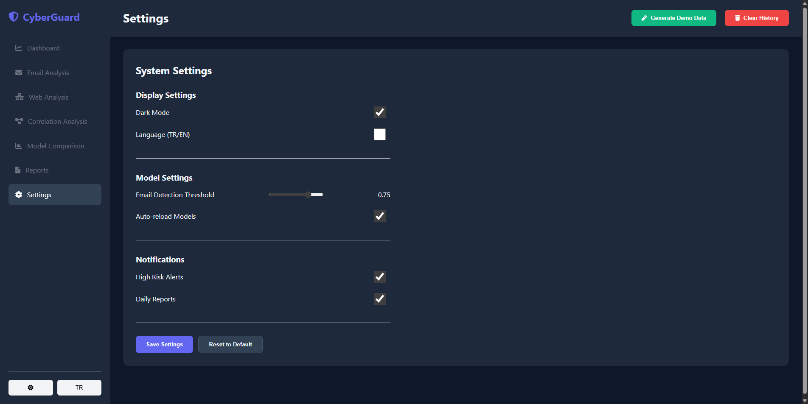

# 🛡️ CyberGuard - Unified Cyber Threat Detection Platform

[](docs/DEPLOYMENT_GUIDE.md)
[](requirements.txt)
[](#-docker-deployment)
[](LICENSE)
[](#-ai-models)

> **Enterprise-grade AI-powered cyber threat detection platform** that combines email phishing detection and web log analysis to identify coordinated attacks in real-time using multiple machine learning models.

---

## 📋 Table of Contents

- [Overview](#-overview)
- [Key Features](#-key-features)
- [Screenshots](#-screenshots)
- [Quick Start](#-quick-start)
- [System Architecture](#-system-architecture)
- [AI Models](#-ai-models)
- [API Reference](#-api-reference)
- [Dashboard Guide](#-dashboard-guide)
- [Configuration](#-configuration)
- [Project Structure](#-project-structure)
- [Development](#-development)
- [Testing](#-testing)
- [Troubleshooting](#-troubleshooting)
- [Contributing](#-contributing)
- [License](#-license)

---

## 🎯 Overview

### What is CyberGuard?

CyberGuard is a comprehensive cybersecurity platform designed to detect and analyze threats across multiple attack vectors. It uses state-of-the-art Natural Language Processing (NLP) and Machine Learning (ML) techniques to identify:

- **Email-based threats:** Phishing emails, spam, social engineering attacks
- **Web-based threats:** SQL injection, XSS, DDoS, brute force attacks, malicious bot activity
- **Coordinated attacks:** Cross-platform threats that combine email and web attack vectors

### Why CyberGuard?

Traditional security systems rely on signature-based detection, which fails against zero-day attacks and evolving threats. CyberGuard uses AI to:

1. **Learn patterns** from historical data to detect new threats
2. **Combine multiple models** for higher accuracy and lower false positives
3. **Correlate threats** across different attack vectors
4. **Provide explainable results** so security analysts understand why something is flagged

### Who is it for?

- **Security Operations Center (SOC) teams** monitoring enterprise networks
- **IT Security professionals** analyzing email and web traffic
- **Small and medium businesses** needing affordable AI-powered security
- **Researchers and students** learning about ML in cybersecurity

---

## ✨ Key Features

### Core Capabilities

| Feature | Description | Technology |
|---------|-------------|------------|
| 📧 **Email Phishing Detection** | Analyzes email content using 3 AI models simultaneously | BERT, FastText, TF-IDF |
| 🌐 **Web Log Analysis** | Detects SQL injection, XSS, DDoS, and bot attacks | Isolation Forest |
| 🔗 **Threat Correlation** | Links email and web threats to identify coordinated attacks | Pearson Correlation, IP Tracking |
| 📊 **Real-time Dashboard** | Interactive charts, statistics, and threat visualization | Chart.js, JavaScript |
| 🌍 **Multi-language Support** | Full Turkish and English interface | i18next |
| 🌙 **Theme Support** | Dark and light mode with persistent preferences | CSS + LocalStorage + API |
| 📥 **Import/Export** | Data exchange in Excel and JSON formats | pandas, openpyxl |
| 🐳 **Docker Deployment** | Production-ready with 6 containers | Docker Compose |
| 📈 **Monitoring Stack** | Performance metrics and visualization | Prometheus, Grafana |
| 🔐 **Security Features** | Rate limiting, input validation | Redis, Flask |

### Performance Metrics

| Model | Accuracy | Speed | Best For |
|-------|----------|-------|----------|
| **BERT (DistilBERT)** | 94-97% | ~45ms | High-accuracy requirements |
| **FastText** | 90-94% | <1ms | High-volume real-time processing |
| **TF-IDF + Random Forest** | 89.75% | ~25ms | Explainable results |
| **Isolation Forest** | 92%+ | ~15ms | Web anomaly detection |

### Model Comparison

| Metric | BERT | FastText | TF-IDF + RF |
|--------|------|----------|-------------|
| **Accuracy** | 94-97% | 90-94% | 89.75% |
| **Precision** | 95% | 92% | 90% |
| **Recall** | 93% | 90% | 88% |
| **F1-Score** | 94% | 91% | 89% |
| **ROC-AUC** | 98%+ | 95%+ | 97.50% |
| **Training Data** | 31,000+ emails | 31,000+ emails | 31,000+ emails |
| **Model Size** | ~250MB | ~881MB | ~50MB |

---

## 📸 Screenshots

### Main Dashboard


The dashboard is the central control panel of the system, providing:
- **Statistics Cards:** Email analysis count, Web anomaly count, Total threats, System status (100% operational)
- **Threat Distribution Chart:** Donut chart showing phishing vs legitimate ratio
- **Model Performance Chart:** Bar chart comparing model accuracy
- **Recent Alerts:** Latest threat notifications with severity levels
- **Quick Actions:** Generate demo data, Clear history buttons

---

### Email Phishing Analysis


The email analysis page allows users to:
- **Input email content:** Subject, sender address, and body text
- **Analyze with 3 models:** BERT, FastText, and TF-IDF run simultaneously
- **View detailed results:** Each model shows prediction, confidence score, risk level
- **See feature importance:** LIME explanations show which words triggered the detection
- **Clear and reset:** Easy form management

**Example Phishing Detection:**
- Input: "URGENT: Your account will be suspended! Click here immediately..."
- Result: 🚨 **PHISHING** detected with 95%+ confidence across all models

---

### Web Log Analysis


The web log analysis page accepts:
- **IP Address:** Client IP (known malicious IPs are flagged)
- **HTTP Method:** GET, POST, PUT, DELETE, etc.
- **Request Path:** URL path (SQL injection patterns are detected)
- **Status Code:** HTTP response code (multiple 401/403 = suspicious)
- **User Agent:** Browser/bot identifier (sqlmap, nikto, etc. are flagged)
- **Response Size:** Abnormal sizes may indicate data exfiltration

**Example Anomaly Detection:**
- Input: IP=45.142.212.61, Method=POST, Path=/admin/login, User-Agent=sqlmap/1.0
- Result: 🚨 **ANOMALY DETECTED** - SQL injection tool identified

---

### Correlation Analysis


The correlation analysis page shows:
- **Correlation Score:** Pearson coefficient (-1 to +1)
- **Correlation Strength:** Very Weak / Weak / Moderate / Strong
- **Coordinated Attacks Count:** Threats occurring in the same time window
- **IP Boost:** Bonus score when same IP appears in both email and web threats
- **Threat Timeline:** Hourly chart showing email vs web threats over time
- **Correlation Heatmap:** Visual representation of threat relationships
- **IP-based Coordination:** List of IPs involved in multi-vector attacks

---

### Model Comparison


Compare all AI models side by side:
- **Accuracy Chart:** Bar chart comparing model accuracy percentages
- **Precision vs Recall:** Scatter plot showing the trade-off
- **F1-Score Comparison:** Overall model performance
- **Model Cards:** Detailed metrics for each model (SVM, Naive Bayes, Isolation Forest)

---

### Reports Page


Export and import functionality:
- **Export to Excel:** Download all threat data as .xlsx file
- **Export to JSON:** API-friendly format for integration
- **Import from Excel:** Bulk upload email or web log data
- **Import from JSON:** Programmatic data import
- **Date Range Filter:** Filter reports by time period
- **Threat Type Filter:** Filter by phishing, anomaly, or all

---

### Settings Page


System configuration options:
- **Dark Mode Toggle:** Switch between light and dark themes
- **Language Checkbox:** Toggle Turkish language (English default)
- **Detection Threshold Slider:** Adjust phishing sensitivity (0.0 - 1.0)
- **High Risk Alerts Toggle:** Enable notifications for critical threats
- **Daily Reports Toggle:** Receive daily summary emails
- **Save Settings Button:** Persist changes to database
- **Reset to Default Button:** Restore original settings

---

## 🚀 Quick Start

### System Requirements

| Component | Minimum | Recommended |
|-----------|---------|-------------|
| **Operating System** | Windows 10, Linux, macOS | Windows 11, Ubuntu 22.04 |
| **Python** | 3.8 | 3.10+ |
| **RAM** | 4GB | 8GB+ |
| **Disk Space** | 2GB | 5GB+ |
| **Docker** | 20.10+ | 24.0+ |
| **Docker Compose** | 1.29+ | 2.0+ |

### 🐳 Docker Deployment (Recommended)

This is the easiest way to get started. All dependencies are containerized.

```bash
# 1. Clone the repository
git clone https://github.com/TheLastKhan/UnifiedCyberThreatDetectionSystem.git
cd UnifiedCyberThreatDetectionSystem

# 2. Start all containers (this may take a few minutes on first run)
docker-compose up -d

# 3. Check container status
docker-compose ps

# 4. Verify the API is healthy
curl http://localhost:5000/api/health
# Expected: {"status": "healthy", "version": "1.0.0"}

# 5. Open the dashboard in your browser
# http://localhost:5000
```

### Service Access Points

| Service | URL | Credentials | Purpose |
|---------|-----|-------------|---------|
| **Web Dashboard** | http://localhost:5000 | None | Main user interface |
| **Grafana** | http://localhost:3000 | admin / admin | Metrics visualization |
| **Prometheus** | http://localhost:9090 | None | Metrics collection |
| **PostgreSQL** | localhost:5432 | postgres / postgres | Database |
| **Redis** | localhost:6379 | None | Cache |

### 💻 Manual Installation (Development)

For local development without Docker:

```bash
# 1. Clone the repository
git clone https://github.com/TheLastKhan/UnifiedCyberThreatDetectionSystem.git
cd UnifiedCyberThreatDetectionSystem

# 2. Create virtual environment
python -m venv venv

# 3. Activate virtual environment
# Windows:
venv\Scripts\activate
# Linux/macOS:
source venv/bin/activate

# 4. Install dependencies
pip install -r requirements.txt

# 5. Run the dashboard
python run_dashboard.py

# 6. Open browser
# http://localhost:5000
```

### First Steps After Installation

1. **Generate Demo Data:** Click "Generate Demo Data" button to create sample threats
2. **Test Email Analysis:** Go to "Email Analysis" and submit a phishing email
3. **Test Web Analysis:** Go to "Web Analysis" and submit a suspicious log entry
4. **View Correlation:** Check "Correlation Analysis" to see threat relationships
5. **Customize Settings:** Go to "Settings" to configure preferences

---

## 🏗️ System Architecture

### High-Level Architecture

```
┌─────────────────────────────────────────────────────────────────────────┐
│                           USER INTERFACE LAYER                          │
│  ┌─────────────┐ ┌─────────────┐ ┌─────────────┐ ┌─────────────────┐   │
│  │  Dashboard  │ │   Email     │ │   Web Log   │ │    Reports &    │   │
│  │    Panel    │ │  Analysis   │ │  Analysis   │ │    Settings     │   │
│  └──────┬──────┘ └──────┬──────┘ └──────┬──────┘ └────────┬────────┘   │
└─────────┼───────────────┼───────────────┼─────────────────┼────────────┘
          │               │               │                 │
          └───────────────┴───────────────┴─────────────────┘
                                  │
                                  ▼
┌─────────────────────────────────────────────────────────────────────────┐
│                          FLASK REST API LAYER                           │
│                                                                         │
│  ┌──────────────┐ ┌──────────────┐ ┌──────────────┐ ┌──────────────┐   │
│  │ /api/email/* │ │/api/predict/*│ │/api/correlat*│ │  /api/other  │   │
│  │              │ │              │ │              │ │              │   │
│  │ - analyze    │ │ - web        │ │ - analyze    │ │ - health     │   │
│  │ - bert       │ │              │ │              │ │ - settings   │   │
│  │ - fasttext   │ │              │ │              │ │ - dashboard  │   │
│  │ - hybrid     │ │              │ │              │ │ - reports    │   │
│  └──────┬───────┘ └──────┬───────┘ └──────┬───────┘ └──────┬───────┘   │
└─────────┼────────────────┼────────────────┼────────────────┼───────────┘
          │                │                │                │
          ▼                ▼                ▼                ▼
┌─────────────────────────────────────────────────────────────────────────┐
│                          MACHINE LEARNING LAYER                         │
│                                                                         │
│  ┌─────────────┐  ┌─────────────┐  ┌─────────────┐  ┌─────────────┐    │
│  │    BERT     │  │  FastText   │  │  TF-IDF +   │  │  Isolation  │    │
│  │ (DistilBERT)│  │   Model     │  │Random Forest│  │   Forest    │    │
│  │             │  │             │  │             │  │             │    │
│  │ Accuracy:   │  │ Accuracy:   │  │ Accuracy:   │  │ Accuracy:   │    │
│  │   94-97%    │  │   90-94%    │  │   89.75%    │  │    92%+     │    │
│  │             │  │             │  │             │  │             │    │
│  │ Speed:      │  │ Speed:      │  │ Speed:      │  │ Speed:      │    │
│  │   ~45ms     │  │   <1ms      │  │   ~25ms     │  │   ~15ms     │    │
│  └─────────────┘  └─────────────┘  └─────────────┘  └─────────────┘    │
│                                                                         │
│  ┌─────────────────────────────────────────────────────────────────┐   │
│  │                    CORRELATION ENGINE                            │   │
│  │  - Pearson correlation calculation                               │   │
│  │  - IP-based attack linking                                       │   │
│  │  - Time-window coordination detection                            │   │
│  └─────────────────────────────────────────────────────────────────┘   │
└─────────────────────────────────────────────────────────────────────────┘
                                  │
                                  ▼
┌─────────────────────────────────────────────────────────────────────────┐
│                            DATA LAYER                                   │
│                                                                         │
│  ┌────────────┐  ┌────────────┐  ┌────────────┐  ┌────────────┐        │
│  │ PostgreSQL │  │   Redis    │  │ Prometheus │  │  Grafana   │        │
│  │            │  │            │  │            │  │            │        │
│  │ - Threats  │  │ - Cache    │  │ - Metrics  │  │ - Dashboards│       │
│  │ - Settings │  │ - Sessions │  │ - Alerts   │  │ - Graphs   │        │
│  │ - Reports  │  │ - Rate Lim │  │ - Logs     │  │ - Alerting │        │
│  │            │  │            │  │            │  │            │        │
│  │ Port: 5432 │  │ Port: 6379 │  │ Port: 9090 │  │ Port: 3000 │        │
│  └────────────┘  └────────────┘  └────────────┘  └────────────┘        │
└─────────────────────────────────────────────────────────────────────────┘
```

### Docker Container Architecture

| Container | Image | Port | Purpose | Dependencies |
|-----------|-------|------|---------|--------------|
| `threat-detection-api` | Custom Flask | 5000 | Main API + ML Models | db, cache |
| `threat-db` | PostgreSQL 15 | 5432 | Primary database | None |
| `cache` | Redis 7 | 6379 | Caching & rate limiting | None |
| `nginx` | Nginx | 80, 443 | Reverse proxy, SSL | api |
| `prometheus` | Prometheus | 9090 | Metrics collection | api |
| `grafana` | Grafana | 3000 | Metrics visualization | prometheus |

### Data Flow

1. **User Input:** User submits email content or web log via dashboard
2. **API Processing:** Flask API receives and validates the request
3. **Model Inference:** Appropriate ML model(s) analyze the input
4. **Result Storage:** Predictions are saved to PostgreSQL
5. **Response:** Results returned to user with confidence scores
6. **Correlation:** Background job links related threats
7. **Monitoring:** Prometheus collects metrics, Grafana displays dashboards

---

## 🤖 AI Models

### 1. BERT (DistilBERT) - Deep Contextual Understanding

BERT (Bidirectional Encoder Representations from Transformers) is the most accurate model in our system.

**Technical Details:**
- **Architecture:** DistilBERT (distilled version of BERT)
- **Parameters:** 66 million
- **Training Data:** 31,000+ labeled emails (CEAS, Enron, Nigerian Fraud, SpamAssassin)
- **Fine-tuning:** Transfer learning from pre-trained DistilBERT
- **Tokenizer:** WordPiece with 30,522 vocabulary size

**Why BERT?**
- Understands context: "Click here to verify" is suspicious, but "Click here to view the report" may not be
- Handles typos and variations: "Paypa1" vs "PayPal"
- Captures semantic meaning: Urgency, threats, rewards

**API Usage:**
```bash
POST /api/email/analyze/bert
Content-Type: application/json

{
    "subject": "URGENT: Your account will be suspended!",
    "sender": "security@paypal-fake.com",
    "body": "Dear Customer, Your account has been compromised. Click here immediately to verify your identity or your account will be permanently closed within 24 hours."
}
```

**Response:**
```json
{
    "prediction": "phishing",
    "confidence": 0.97,
    "risk_level": "critical",
    "model": "bert",
    "processing_time_ms": 45,
    "features": {
        "urgency_score": 0.92,
        "threat_score": 0.88,
        "suspicious_url": true
    }
}
```

---

### 2. FastText - Ultra-Fast Processing

FastText is optimized for high-volume, real-time processing.

**Technical Details:**
- **Architecture:** Word embeddings + Linear classifier
- **Developer:** Facebook AI Research
- **Model Size:** 881 MB (includes word vectors)
- **Training:** Supervised learning on labeled dataset
- **Inference Speed:** Sub-millisecond (<1ms)

**Why FastText?**
- Extremely fast: Can process millions of emails per hour
- Handles out-of-vocabulary words: Uses subword information
- Lightweight inference: No GPU required

**API Usage:**
```bash
POST /api/email/analyze/fasttext
Content-Type: application/json

{
    "body": "Congratulations! You have won $1,000,000 in the international lottery. Click here to claim your prize immediately!"
}
```

**Response:**
```json
{
    "prediction": "phishing",
    "confidence": 0.94,
    "risk_level": "high",
    "model": "fasttext",
    "processing_time_ms": 0.8
}
```

---

### 3. TF-IDF + Random Forest - Explainable Baseline

This ensemble model provides interpretable results with feature importance.

**Technical Details:**
- **Vectorization:** TF-IDF (Term Frequency-Inverse Document Frequency)
- **Classifier:** Random Forest with 100 trees
- **Balancing:** SMOTE (Synthetic Minority Oversampling)
- **Accuracy:** 89.75%
- **ROC-AUC:** 97.50%

**Why TF-IDF + RF?**
- Explainable: Shows which words triggered the detection
- Reliable baseline: Works well without deep learning
- Fast training: Can be retrained quickly on new data

**API Usage:**
```bash
POST /api/email/analyze
Content-Type: application/json

{
    "subject": "Meeting tomorrow at 3pm",
    "sender": "colleague@company.com",
    "body": "Hi, Just a reminder about our meeting tomorrow at 3pm in the conference room. Please bring the quarterly reports. Best regards, John"
}
```

**Response:**
```json
{
    "prediction": "legitimate",
    "confidence": 0.92,
    "risk_level": "low",
    "model": "tfidf_rf",
    "processing_time_ms": 25,
    "feature_importance": {
        "meeting": 0.15,
        "reminder": 0.12,
        "conference": 0.08,
        "quarterly": 0.06
    }
}
```

---

### 4. Isolation Forest - Web Anomaly Detection

Isolation Forest detects anomalous web traffic patterns.

**Technical Details:**
- **Algorithm:** Isolation Forest (unsupervised anomaly detection)
- **Features:** IP reputation, request frequency, path patterns, user-agent analysis
- **Attack Types Detected:**
  - SQL Injection (sqlmap, union select, etc.)
  - Cross-Site Scripting (XSS)
  - Path Traversal (../, directory traversal)
  - Brute Force (multiple failed logins)
  - DDoS patterns (abnormal request rates)
  - Bot/Crawler activity (suspicious user-agents)

**API Usage:**
```bash
POST /api/predict/web
Content-Type: application/json

{
    "ip": "45.142.212.61",
    "method": "POST",
    "path": "/admin/login",
    "status": 401,
    "user_agent": "sqlmap/1.0",
    "response_size": 512
}
```

**Response:**
```json
{
    "is_anomaly": true,
    "anomaly_score": 0.89,
    "risk_level": "critical",
    "patterns_detected": ["sql_injection_tool", "admin_access_attempt"],
    "ip_reputation": "malicious",
    "processing_time_ms": 15
}
```

---

### 5. Hybrid Analysis - All Models Combined

For maximum accuracy, use the hybrid endpoint that runs all models.

**API Usage:**
```bash
POST /api/email/analyze/hybrid
Content-Type: application/json

{
    "subject": "Your package delivery failed",
    "sender": "delivery@fedex-tracking.xyz",
    "body": "Your package could not be delivered. Click here to reschedule delivery and pay the $2.99 fee."
}
```

**Response:**
```json
{
    "final_prediction": "phishing",
    "final_confidence": 0.96,
    "ensemble_method": "weighted_voting",
    "models": {
        "bert": {"prediction": "phishing", "confidence": 0.97},
        "fasttext": {"prediction": "phishing", "confidence": 0.94},
        "tfidf_rf": {"prediction": "phishing", "confidence": 0.91}
    },
    "weights": {"bert": 0.4, "fasttext": 0.3, "tfidf_rf": 0.3},
    "total_processing_time_ms": 72
}
```

---

## 📡 API Reference

### Base URL

```
http://localhost:5000/api
```

### Authentication

Currently, no authentication is required for the API. For production deployment, implement JWT or API keys.

### Endpoints

#### Health Check

| Method | Endpoint | Description |
|--------|----------|-------------|
| GET | `/health` | Check API health status |

```bash
curl http://localhost:5000/api/health
```

Response:
```json
{"status": "healthy", "version": "1.0.0", "timestamp": "2025-12-27T19:40:50.662904"}
```

---

#### Model Status

| Method | Endpoint | Description |
|--------|----------|-------------|
| GET | `/models/status` | Get status of all ML models |

```bash
curl http://localhost:5000/api/models/status
```

Response:
```json
{
    "models": {
        "bert": {"loaded": true, "version": "1.0"},
        "fasttext": {"loaded": true, "version": "1.0"},
        "tfidf_rf": {"loaded": true, "version": "1.0"},
        "isolation_forest": {"loaded": true, "version": "1.0"}
    },
    "total_models": 4,
    "all_loaded": true
}
```

---

#### Email Analysis

| Method | Endpoint | Description |
|--------|----------|-------------|
| POST | `/email/analyze` | Analyze with TF-IDF + RF |
| POST | `/email/analyze/bert` | Analyze with BERT |
| POST | `/email/analyze/fasttext` | Analyze with FastText |
| POST | `/email/analyze/hybrid` | Analyze with all models |

---

#### Web Log Analysis

| Method | Endpoint | Description |
|--------|----------|-------------|
| POST | `/predict/web` | Analyze web log for anomalies |

---

#### Correlation Analysis

| Method | Endpoint | Description |
|--------|----------|-------------|
| GET | `/correlation/analyze` | Get threat correlation analysis |

---

#### Dashboard

| Method | Endpoint | Description |
|--------|----------|-------------|
| GET | `/dashboard/stats` | Get dashboard statistics |

---

#### Reports

| Method | Endpoint | Description |
|--------|----------|-------------|
| GET | `/reports/export/excel` | Export threats to Excel |
| GET | `/reports/export/json` | Export threats to JSON |
| POST | `/reports/import/excel` | Import threats from Excel |
| POST | `/reports/import/json` | Import threats from JSON |

---

#### Settings

| Method | Endpoint | Description |
|--------|----------|-------------|
| GET | `/settings` | Get current settings |
| POST | `/settings` | Save settings |

---

#### Data Management

| Method | Endpoint | Description |
|--------|----------|-------------|
| POST | `/demo/generate` | Generate demo threat data |
| POST | `/database/clear` | Clear all threat data |

---

## 🖥️ Dashboard Guide

### Navigation Menu

| Page | Purpose | Key Features |
|------|---------|--------------|
| **Dashboard** | Overview and statistics | Stats cards, charts, recent alerts |
| **Email Analysis** | Analyze email content | 3-model analysis, risk scoring |
| **Web Analysis** | Analyze web logs | Anomaly detection, pattern matching |
| **Correlation Analysis** | Link threats | Correlation score, coordinated attacks |
| **Model Comparison** | Compare model performance | Accuracy, precision, recall charts |
| **Reports** | Export/Import data | Excel, JSON formats |
| **Settings** | Configure system | Theme, language, thresholds |

### Top Menu Buttons

| Button | Action | Description |
|--------|--------|-------------|
| **Generate Demo Data** | Creates sample threats | 30 emails + 30 web logs + 5 coordinated attacks |
| **Clear History** | Deletes all data | Resets all statistics to zero |
| **☀/🌙 (Theme)** | Toggles theme | Switches between light and dark mode |
| **TR/EN (Language)** | Toggles language | Switches between Turkish and English |

### Theme and Language Persistence

All preferences are saved to both:
1. **localStorage:** For instant UI response
2. **PostgreSQL database:** For persistence across sessions and devices

When you change the theme or language, it will persist even after:
- Closing the browser
- Clearing browser cache (if using database)
- Accessing from different devices (if using database)

---

## ⚙️ Configuration

### Environment Variables

Create a `.env` file in the project root:

```bash
# Database Configuration
DATABASE_URL=postgresql://postgres:postgres@db:5432/threat_detection
POSTGRES_USER=postgres
POSTGRES_PASSWORD=postgres
POSTGRES_DB=threat_detection

# Redis Configuration
REDIS_URL=redis://cache:6379/0

# Flask Configuration
FLASK_ENV=production
FLASK_DEBUG=0
SECRET_KEY=your-very-secure-secret-key-here

# Logging
LOG_LEVEL=INFO

# Optional: VirusTotal Integration
VIRUSTOTAL_API_KEY=your_api_key_here

# Optional: Email Notifications
SMTP_HOST=smtp.gmail.com
SMTP_PORT=587
SMTP_USER=your-email@gmail.com
SMTP_PASSWORD=your-app-password
```

### Settings Page Options

| Setting | Type | Default | Description |
|---------|------|---------|-------------|
| **Dark Mode** | Toggle | Off | Enable dark theme |
| **Language** | Checkbox | English | Enable Turkish language |
| **Detection Threshold** | Slider | 0.50 | Phishing detection sensitivity (0.0 = more sensitive, 1.0 = less sensitive) |
| **High Risk Alerts** | Toggle | On | Show notifications for critical threats |
| **Daily Reports** | Toggle | Off | Email daily summary report |
| **Auto Reload** | Toggle | On | Auto-refresh dashboard data |

---

## 📁 Project Structure

```
UnifiedCyberThreatDetectionSystem/
├── web_dashboard/                 # Web Interface
│   ├── api.py                    # Flask API endpoints (2000+ lines)
│   ├── app.py                    # Flask application factory
│   ├── database.py               # Database operations
│   ├── static/
│   │   ├── css/
│   │   │   ├── styles.css        # Main stylesheet
│   │   │   └── theme.css         # Theme variables
│   │   ├── js/
│   │   │   ├── script.js         # Main JavaScript (2300+ lines)
│   │   │   └── theme-toggle.js   # Theme management
│   │   └── i18n/
│   │       ├── en.json           # English translations
│   │       └── tr.json           # Turkish translations
│   └── templates/
│       └── dashboard.html        # Main HTML template
│
├── src/
│   ├── email_detector/           # Email ML Models
│   │   ├── bert_detector.py      # BERT implementation
│   │   ├── fasttext_detector.py  # FastText implementation
│   │   ├── tfidf_detector.py     # TF-IDF + RF implementation
│   │   └── detector.py           # Unified detector interface
│   │
│   ├── web_analyzer/             # Web Log Analysis
│   │   ├── analyzer.py           # Isolation Forest implementation
│   │   └── patterns.py           # Attack pattern definitions
│   │
│   └── unified_platform/         # Correlation Engine
│       └── correlation.py        # Threat correlation logic
│
├── models/                       # Trained ML Models
│   ├── bert_finetuned/           # BERT model files
│   ├── tfidf_vectorizer.pkl      # TF-IDF vectorizer
│   └── random_forest.pkl         # Random Forest classifier
│
├── training/                     # Model Training Scripts
│   ├── train_bert.py             # BERT fine-tuning
│   ├── train_fasttext_local.py   # FastText training
│   └── train_tfidf_local.py      # TF-IDF training
│
├── tests/                        # Test Suite
│   ├── test_api.py               # API endpoint tests
│   ├── test_email_detector.py    # Email model tests
│   └── test_web_analyzer.py      # Web analyzer tests
│
├── docs/                         # Documentation
│   ├── professor_report/         # Project report + screenshots
│   │   ├── screenshots/          # UI screenshots
│   │   └── CyberGuard_Proje_Raporu_v2.docx
│   ├── API_DOCUMENTATION.md
│   └── DEPLOYMENT_GUIDE.md
│
├── docker-compose.yml            # Docker configuration
├── Dockerfile                    # API container definition
├── requirements.txt              # Python dependencies
├── run_dashboard.py              # Local development starter
└── README.md                     # This file
```

---

## 🛠️ Development

### Setting Up Development Environment

```bash
# 1. Clone and enter directory
git clone https://github.com/TheLastKhan/UnifiedCyberThreatDetectionSystem.git
cd UnifiedCyberThreatDetectionSystem

# 2. Create virtual environment
python -m venv venv
source venv/bin/activate  # or venv\Scripts\activate on Windows

# 3. Install dependencies
pip install -r requirements.txt

# 4. Install development dependencies
pip install pytest pytest-cov black flake8

# 5. Run in development mode
python run_dashboard.py
```

### Code Style

We use:
- **Black** for code formatting
- **Flake8** for linting
- **Type hints** for static analysis

```bash
# Format code
black .

# Check linting
flake8 .
```

### Adding New Features

1. Create a feature branch: `git checkout -b feature/my-feature`
2. Make changes
3. Add tests
4. Run tests: `pytest tests/`
5. Commit: `git commit -m "feat: add my feature"`
6. Push: `git push origin feature/my-feature`
7. Create Pull Request

---

## 🧪 Testing

### Running Tests

```bash
# Run all tests
pytest tests/ -v

# Run with coverage
pytest tests/ -v --cov=src --cov=web_dashboard --cov-report=html

# Run specific test file
pytest tests/test_api.py -v

# Run specific test
pytest tests/test_api.py::test_health_endpoint -v
```

### Test Categories

| Test File | Coverage |
|-----------|----------|
| `test_api.py` | API endpoints |
| `test_email_detector.py` | Email ML models |
| `test_web_analyzer.py` | Web log analyzer |
| `test_database.py` | Database operations |
| `test_integration.py` | End-to-end tests |

---

## 🔧 Troubleshooting

### Common Issues

#### Docker containers won't start

```bash
# Check logs
docker-compose logs

# Restart containers
docker-compose down
docker-compose up -d
```

#### API returns 500 error

```bash
# Check API logs
docker-compose logs api

# Restart API container
docker-compose restart api
```

#### Database connection failed

```bash
# Check database container
docker-compose ps db

# Check database logs
docker-compose logs db

# Recreate database
docker-compose down -v
docker-compose up -d
```

#### Models not loading

```bash
# Check if model files exist
ls models/

# Check API logs for loading errors
docker-compose logs api | grep -i "model"
```

---

## 🤝 Contributing

We welcome contributions! Please follow these steps:

1. **Fork** the repository
2. **Create** a feature branch (`git checkout -b feature/amazing-feature`)
3. **Commit** your changes (`git commit -m 'Add amazing feature'`)
4. **Push** to the branch (`git push origin feature/amazing-feature`)
5. **Open** a Pull Request

### Contribution Guidelines

- Write clear commit messages
- Add tests for new features
- Update documentation
- Follow code style guidelines

---

## 📄 License

This project is licensed under the MIT License - see the [LICENSE](LICENSE) file for details.

---

## 🙏 Acknowledgments

- **CEAS 2008 Dataset** - Email training data
- **Enron Email Dataset** - Model validation
- **Hugging Face** - Transformers library
- **Facebook AI Research** - FastText
- **scikit-learn** - Machine learning tools
- **Flask** - Web framework
- **Chart.js** - Visualization library

---

## 📧 Contact

- **GitHub:** [TheLastKhan](https://github.com/TheLastKhan)
- **Repository:** [UnifiedCyberThreatDetectionSystem](https://github.com/TheLastKhan/UnifiedCyberThreatDetectionSystem)

---

<div align="center">

**⭐ If you find this project useful, please consider giving it a star!**

Made with ❤️ for the cybersecurity community

</div>
