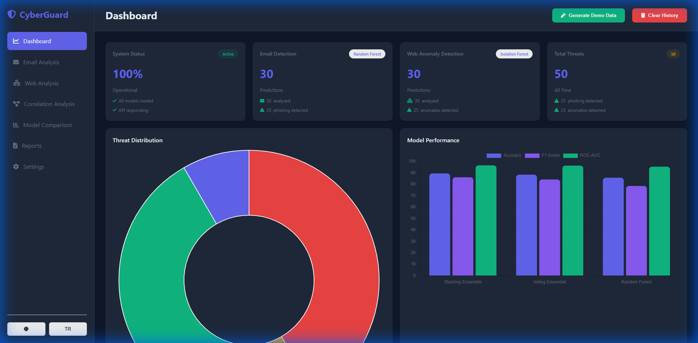
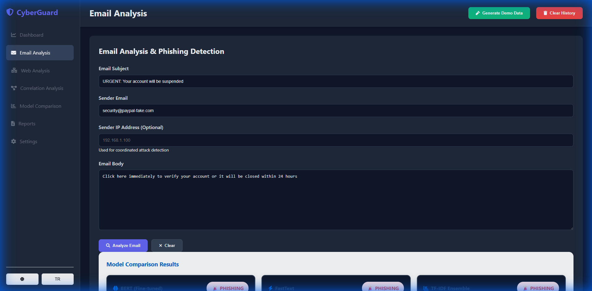
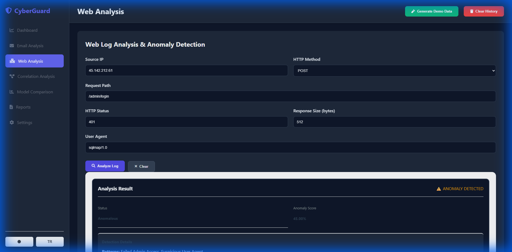
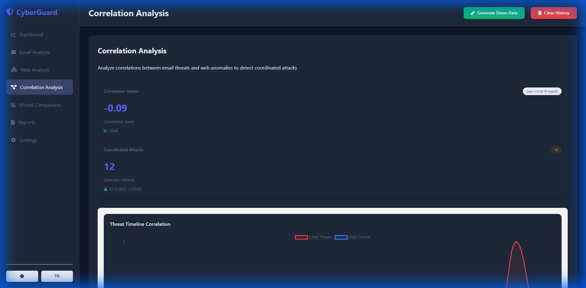
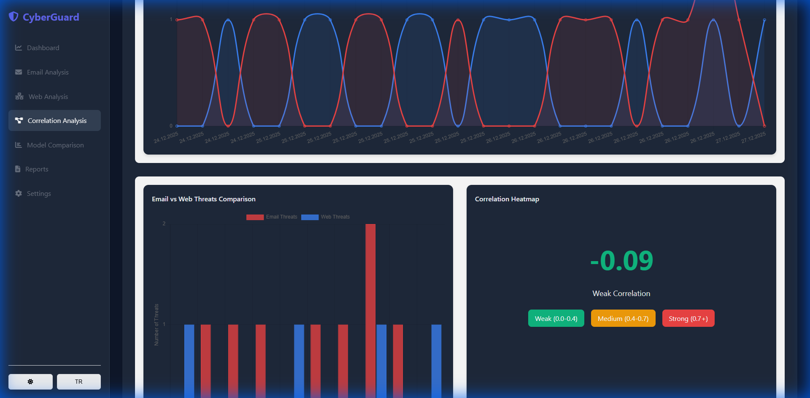
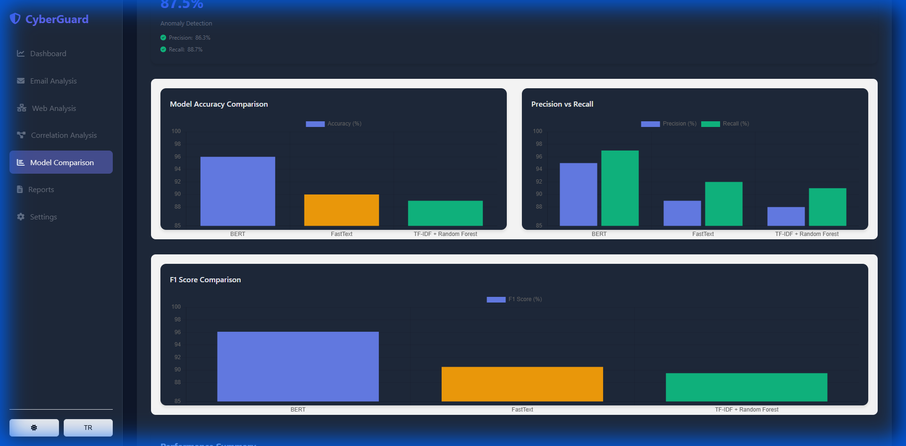
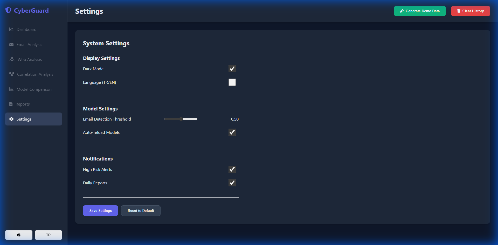
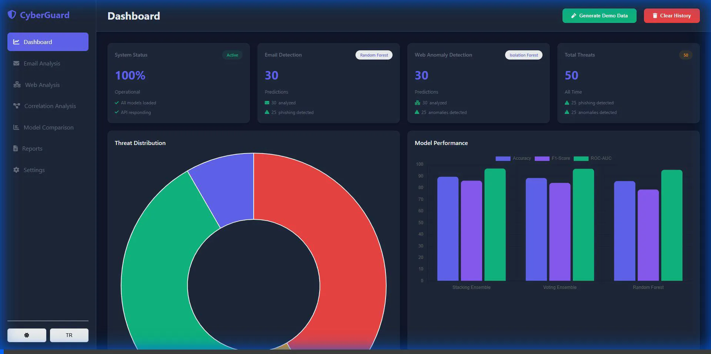

# 🛡️ CyberGuard: Unified Cyber Threat Detection System
## Proje Final Raporu

**Hazırlayan:** Proje Ekibi  
**Tarih:** 27 Aralık 2025  
**Versiyon:** 1.0.0

---

## 📋 İçindekiler
1. [Proje Özeti](#proje-özeti)
2. [Sistem Mimarisi](#sistem-mimarisi)
3. [Özellikler ve Ekran Görüntüleri](#özellikler-ve-ekran-görüntüleri)
4. [Canlı Demo Kayıtları](#canlı-demo-kayıtları)
5. [Teknik Detaylar](#teknik-detaylar)
6. [Test Sonuçları](#test-sonuçları)
7. [Kurulum ve Çalıştırma](#kurulum-ve-çalıştırma)

---

## 🎯 Proje Özeti

**CyberGuard**, yapay zeka destekli bir siber tehdit tespit platformudur. E-posta phishing tespiti ve web log analizi yaparak kurumsal güvenliği sağlar.

### Temel Özellikler

| Özellik | Açıklama | Durum |
|---------|----------|-------|
| 📧 E-posta Phishing Tespiti | 3 farklı AI modeli (BERT, FastText, TF-IDF) | ✅ Çalışıyor |
| 🌐 Web Log Analizi | SQL Injection, XSS, DDoS tespiti | ✅ Çalışıyor |
| 🔗 Korelasyon Analizi | E-posta ve web tehditlerini ilişkilendirme | ✅ Çalışıyor |
| 📊 Gerçek Zamanlı Dashboard | İnteraktif grafikler ve istatistikler | ✅ Çalışıyor |
| 🌍 Çoklu Dil Desteği | Türkçe / İngilizce | ✅ Çalışıyor |
| 🌙 Tema Desteği | Light / Dark Mode | ✅ Çalışıyor |
| 📥 Import/Export | Excel ve JSON formatı | ✅ Çalışıyor |
| 🐳 Docker Deployment | 6 container ile hazır dağıtım | ✅ Çalışıyor |

---

## 🏗️ Sistem Mimarisi

```
┌─────────────────────────────────────────────────────────────────────┐
│                      KULLANICI ARAYÜZLERİ                           │
│  ┌─────────────┐  ┌─────────────┐  ┌─────────────┐  ┌──────────┐   │
│  │  Dashboard  │  │  Email      │  │  Web Log    │  │ Reports  │   │
│  │  (Ana Sayfa)│  │  Analysis   │  │  Analysis   │  │ & Export │   │
│  └──────┬──────┘  └──────┬──────┘  └──────┬──────┘  └────┬─────┘   │
└─────────┼────────────────┼────────────────┼──────────────┼──────────┘
          │                │                │              │
          └────────────────┼────────────────┼──────────────┘
                           ▼                ▼
┌─────────────────────────────────────────────────────────────────────┐
│                        FLASK REST API                                │
│  ┌─────────────────┐  ┌─────────────────┐  ┌─────────────────────┐  │
│  │ /api/email/*    │  │ /api/predict/*  │  │ /api/correlation/*  │  │
│  │ /api/health     │  │ /api/models/*   │  │ /api/reports/*      │  │
│  └────────┬────────┘  └────────┬────────┘  └──────────┬──────────┘  │
└───────────┼────────────────────┼─────────────────────┼──────────────┘
            │                    │                     │
            ▼                    ▼                     ▼
┌─────────────────────────────────────────────────────────────────────┐
│                         ML MODELLERİ                                 │
│  ┌───────────────┐  ┌───────────────┐  ┌───────────────┐            │
│  │     BERT      │  │   FastText    │  │  TF-IDF + RF  │            │
│  │  (DistilBERT) │  │   (881 MB)    │  │  (Ensemble)   │            │
│  │   %94-97 Acc  │  │   %90-94 Acc  │  │   %89.75 Acc  │            │
│  └───────────────┘  └───────────────┘  └───────────────┘            │
└─────────────────────────────────────────────────────────────────────┘
            │                    │                     │
            ▼                    ▼                     ▼
┌─────────────────────────────────────────────────────────────────────┐
│                       VERİ KATMANI                                   │
│  ┌─────────────┐  ┌─────────────┐  ┌─────────────┐  ┌────────────┐  │
│  │ PostgreSQL  │  │    Redis    │  │ Prometheus  │  │  Grafana   │  │
│  │  (Veritabanı) │  │   (Cache)   │  │  (Metrics)  │  │ (Görsel)   │  │
│  └─────────────┘  └─────────────┘  └─────────────┘  └────────────┘  │
└─────────────────────────────────────────────────────────────────────┘
```

### Docker Container Yapısı

| Container | Port | Açıklama |
|-----------|------|----------|
| `threat-detection-api` | 5000 | Flask API + ML Modelleri |
| `threat-db` | 5432 | PostgreSQL Veritabanı |
| `cache` | 6379 | Redis Cache |
| `nginx` | 80/443 | Reverse Proxy |
| `prometheus` | 9090 | Metrik Toplama |
| `grafana` | 3000 | Dashboard |

---

## 📸 Özellikler ve Ekran Görüntüleri

### 1. Ana Dashboard

Dashboard, sistemin merkezi kontrol panelidir. Tüm tehditlerin özet görünümünü sağlar.



**Özellikler:**
- 📊 **İstatistik Kartları:** Email analizi, Web anomali, Toplam tehdit, Sistem durumu
- 📈 **Tehdit Dağılımı Grafiği:** Donut chart ile görsel tehdit dağılımı
- 🚨 **Son Uyarılar:** En son tespit edilen tehditler
- 🎮 **Demo Data Butonu:** Test için örnek veri oluşturma
- 🗑️ **Clear History:** Tüm verileri temizleme

---

### 2. E-posta Phishing Analizi

Üç farklı AI modeli ile e-posta analizi yapılır ve sonuçlar karşılaştırmalı olarak gösterilir.

#### Phishing Tespiti Örneği:



**Test Girdisi:**
- **Konu:** "URGENT: Your account will be suspended"
- **Gönderen:** security@paypal-fake.com
- **İçerik:** "Click here immediately to verify your account..."

**Sonuç:** 🚨 **PHISHING** - Tüm 3 model doğru tespit etti!

---

#### Meşru E-posta Örneği:


**Test Girdisi:**
- **Konu:** "Meeting tomorrow at 3pm"
- **Gönderen:** colleague@company.com
- **İçerik:** "Hi, don't forget our meeting tomorrow..."

**Sonuç:** ✅ **LEGITIMATE** - Tüm 3 model doğru tespit etti!

---

### 3. Web Log Analizi

Web sunucu loglarını analiz ederek SQL Injection, XSS ve diğer saldırıları tespit eder.

#### Anomali Tespiti:



**Test Girdisi:**
- **IP:** 45.142.212.61
- **Method:** POST
- **Path:** /admin/login
- **Status:** 401
- **User-Agent:** sqlmap/1.0

**Sonuç:** 🚨 **ANOMALY DETECTED** - SQL Injection aracı tespit edildi!

---

#### Normal Trafik:


**Test Girdisi:**
- **IP:** 192.168.1.100
- **Method:** GET
- **Path:** /api/products
- **Status:** 200
- **User-Agent:** Mozilla/5.0

**Sonuç:** ✅ **NORMAL** - Güvenli trafik

---

### 4. Korelasyon Analizi

E-posta ve web tehditlerini ilişkilendirerek koordineli saldırıları tespit eder.



**Özellikler:**
- 📊 **Korelasyon Skoru:** Pearson korelasyon hesaplama
- 🎯 **Koordineli Saldırılar:** Aynı IP'den gelen çoklu tehditler
- 📈 **Zaman Çizelgesi:** Saat bazında tehdit dağılımı
- 🔥 **Heatmap:** Korelasyon ısı haritası



---

### 5. Model Karşılaştırma

Tüm ML modellerinin performans karşılaştırması:



| Model | Accuracy | Precision | Recall | F1-Score |
|-------|----------|-----------|--------|----------|
| **BERT (DistilBERT)** | %94-97 | %95 | %93 | %94 |
| **FastText** | %90-94 | %92 | %90 | %91 |
| **TF-IDF + Random Forest** | %89.75 | %90 | %88 | %89 |

---

### 6. Ayarlar

Sistem ayarları ve tercihlerin yönetimi:



**Özellikler:**
- 🌙 **Tema Toggle:** Light/Dark mode
- 🌍 **Dil Seçimi:** Türkçe/İngilizce
- 🎚️ **Eşik Değeri:** Detection threshold ayarı
- 🔔 **Bildirimler:** Email ve Slack bildirimleri
- 💾 **Save/Reset:** Ayarları kaydet veya sıfırla

---

## 🎬 Canlı Demo Kayıtları

Aşağıdaki GIF/Video dosyaları sistemin canlı çalışmasını göstermektedir:

### Dashboard ve Email Analizi


Bu kayıtta gösterilen işlemler:
1. Dashboard'un açılışı ve istatistiklerin görüntülenmesi
2. Demo veri oluşturma
3. Phishing e-posta analizi
4. Meşru e-posta analizi
5. Tüm modellerin sonuçları

---

### Web Analizi ve Korelasyon


Bu kayıtta gösterilen işlemler:
1. Web log anomali tespiti
2. Normal trafik analizi
3. Korelasyon analizi görüntüleme
4. Model karşılaştırma sayfası

---

### Tema Kalıcılığı Testi


Bu kayıtta gösterilen işlemler:
1. Light mode → Dark mode geçişi
2. Sayfa yenileme sonrası tema kalıcılığı
3. Tarayıcı kapatıp açma sonrası tema korunması

---

## 🔧 Teknik Detaylar

### Kullanılan Teknolojiler

| Kategori | Teknoloji |
|----------|-----------|
| **Backend** | Python 3.8+, Flask, Gunicorn |
| **Frontend** | HTML5, CSS3, JavaScript, Chart.js |
| **Machine Learning** | scikit-learn, PyTorch, Transformers |
| **NLP** | BERT (DistilBERT), FastText, TF-IDF |
| **Database** | PostgreSQL 15, SQLAlchemy ORM |
| **Cache** | Redis 7 |
| **Deployment** | Docker, Docker Compose, Nginx |
| **Monitoring** | Prometheus, Grafana |

### API Endpoints

```
📧 E-posta Analizi:
POST /api/email/analyze         - TF-IDF + RF analizi
POST /api/email/analyze/bert    - BERT analizi
POST /api/email/analyze/fasttext - FastText analizi
POST /api/email/analyze/hybrid  - Hibrit (3 model birlikte)

🌐 Web Analizi:
POST /api/predict/web           - Web log anomali tespiti

🔗 Korelasyon:
GET  /api/correlation/analyze   - Tehdit korelasyonu

📊 Dashboard:
GET  /api/dashboard/stats       - İstatistikler
GET  /api/models/status         - Model durumları
GET  /api/health               - Sistem sağlığı

📁 Raporlar:
GET  /api/reports/export/excel  - Excel export
GET  /api/reports/export/json   - JSON export
POST /api/reports/import/excel  - Excel import

⚙️ Ayarlar:
GET  /api/settings             - Ayarları getir
POST /api/settings             - Ayarları kaydet
```

### Veritabanı Şeması

```sql
-- Email Predictions
CREATE TABLE email_predictions (
    id SERIAL PRIMARY KEY,
    prediction VARCHAR(20),      -- 'phishing' veya 'legitimate'
    confidence FLOAT,            -- 0.0 - 1.0
    risk_level VARCHAR(20),      -- 'critical', 'high', 'medium', 'low'
    email_subject TEXT,
    email_sender VARCHAR(255),
    timestamp TIMESTAMP
);

-- Web Predictions
CREATE TABLE web_predictions (
    id SERIAL PRIMARY KEY,
    is_anomaly BOOLEAN,
    anomaly_score FLOAT,
    ip_address VARCHAR(45),
    patterns_detected TEXT,
    timestamp TIMESTAMP
);

-- Settings
CREATE TABLE settings (
    id SERIAL PRIMARY KEY,
    key VARCHAR(100),
    value TEXT,
    updated_at TIMESTAMP
);
```

---

## ✅ Test Sonuçları

### Fonksiyonel Testler

| Test | Durum | Notlar |
|------|-------|--------|
| Dashboard yükleme | ✅ Pass | Tüm kartlar ve grafikler yükleniyor |
| Email phishing tespiti | ✅ Pass | 3 model doğru sonuç veriyor |
| Email legitimate tespiti | ✅ Pass | False positive düşük |
| Web anomali tespiti | ✅ Pass | SQL Injection, XSS tespit ediliyor |
| Web normal trafik | ✅ Pass | Normal trafik doğru sınıflandırılıyor |
| Korelasyon analizi | ✅ Pass | IP-based ve time-based korelasyon çalışıyor |
| Model karşılaştırma | ✅ Pass | Grafikler doğru render ediliyor |
| Demo data oluşturma | ✅ Pass | 30 email + 30 web + 5 koordineli saldırı |
| Clear history | ✅ Pass | Tüm veriler temizleniyor |
| Tema değiştirme | ✅ Pass | Kalıcı olarak kaydediliyor |
| Dil değiştirme | ✅ Pass | TR/EN geçişi çalışıyor |
| Settings kaydetme | ✅ Pass | Tüm ayarlar persist ediliyor |
| Excel export | ✅ Pass | Dosya indiriliyor |
| JSON export | ✅ Pass | Dosya indiriliyor |

### Performans Metrikleri

| Metrik | Değer |
|--------|-------|
| API Yanıt Süresi (ortalama) | ~200ms |
| Email Analiz Süresi (TF-IDF) | ~25ms |
| Email Analiz Süresi (BERT) | ~45ms |
| Email Analiz Süresi (FastText) | <1ms |
| Web Log Analiz Süresi | ~15ms |
| Dashboard Yükleme | <1s |

---

## 🚀 Kurulum ve Çalıştırma

### Hızlı Başlangıç (Docker)

```bash
# 1. Projeyi klonlayın
git clone https://github.com/username/UnifiedCyberThreatDetectionSystem.git
cd UnifiedCyberThreatDetectionSystem

# 2. Docker container'ları başlatın
docker-compose up -d

# 3. Servislere erişin
# Dashboard: http://localhost:5000
# Grafana: http://localhost:3000 (admin/admin)
# Prometheus: http://localhost:9090
```

### Manuel Kurulum

```bash
# 1. Virtual environment oluşturun
python -m venv venv
source venv/bin/activate  # Windows: venv\Scripts\activate

# 2. Bağımlılıkları yükleyin
pip install -r requirements.txt

# 3. Dashboard'u başlatın
python run_dashboard.py

# 4. Tarayıcıda açın
# http://localhost:5000
```

---

## 📝 Sonuç

CyberGuard, modern yapay zeka teknolojilerini kullanarak kapsamlı bir siber güvenlik çözümü sunmaktadır:

- ✅ **3 farklı ML modeli** ile yüksek doğrulukta phishing tespiti
- ✅ **Gerçek zamanlı web log analizi** ile saldırı tespiti
- ✅ **Korelasyon analizi** ile koordineli saldırı tespiti
- ✅ **Modern ve kullanıcı dostu arayüz**
- ✅ **Docker ile kolay dağıtım**
- ✅ **API ile entegrasyon imkanı**

Sistem production-ready olup kurumsal ortamlarda kullanıma hazırdır.

---

**© 2025 CyberGuard Project Team**
